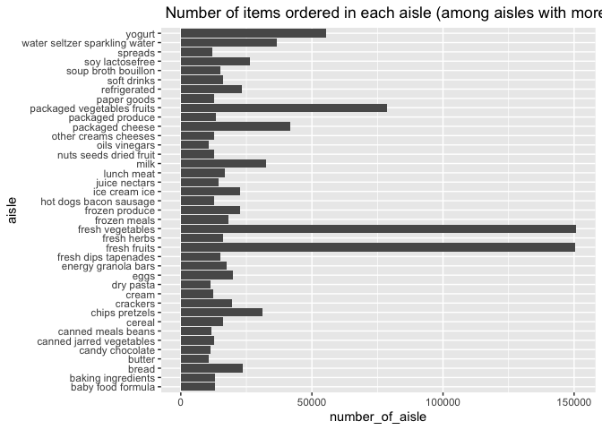
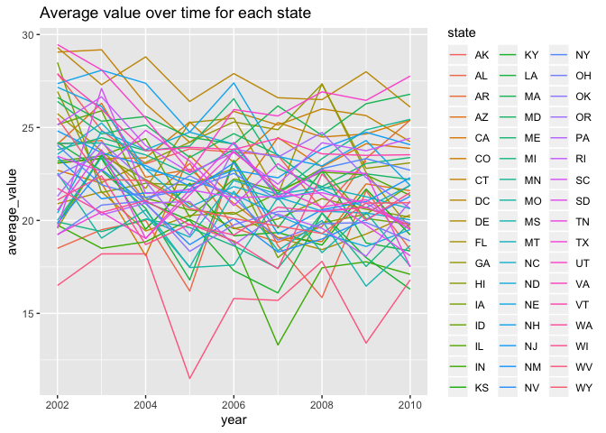
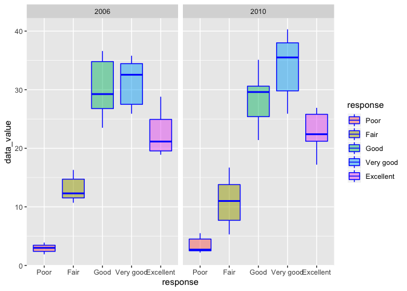
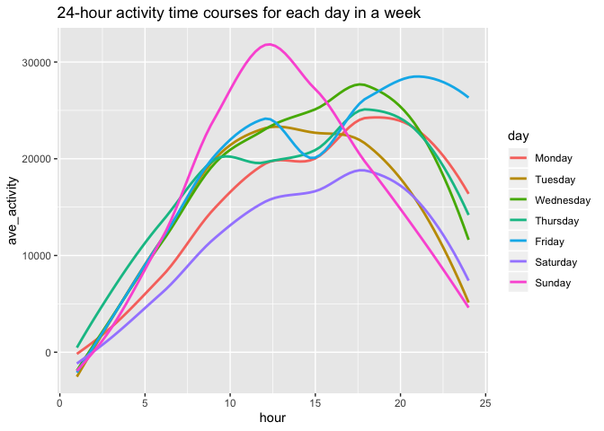

p8105\_hw3\_xc2473
================

``` r
library(tidyverse)
```

    ## ── Attaching packages ──────────────────────────────────────────────────── tidyverse 1.2.1 ──

    ## ✔ ggplot2 3.2.1     ✔ purrr   0.3.2
    ## ✔ tibble  2.1.3     ✔ dplyr   0.8.3
    ## ✔ tidyr   1.0.0     ✔ stringr 1.4.0
    ## ✔ readr   1.3.1     ✔ forcats 0.4.0

    ## ── Conflicts ─────────────────────────────────────────────────────── tidyverse_conflicts() ──
    ## ✖ dplyr::filter() masks stats::filter()
    ## ✖ dplyr::lag()    masks stats::lag()

``` r
library(ggridges)
```

    ## 
    ## Attaching package: 'ggridges'

    ## The following object is masked from 'package:ggplot2':
    ## 
    ##     scale_discrete_manual

``` r
###Question 1

library(p8105.datasets)
data("instacart")

ins_df = 
  instacart %>%   
  janitor::clean_names()  
```

There are 1384617 observations and 15 variables in the dataset. The key
variables are ailse, deparment, product\_name, order\_number,
order\_dow, order\_hour\_of\_day. For these key variables, the missing
value are 0, 0, 0, 0, 0, 0, respectively. Other than ailese, department,
product\_name, eval\_set, all variables are class integer or numeric.
The mean value of the day of the week on which the order was placed was
2.701. The mean value of the hour of the day on which the order was
placed was 13.578.

There are 134 different aisles in the dataset. **Fresh\_vegetables** are
the aisle which most items ordered from, and the amount of order for
this aisle is 150609.

``` r
#### Make a plot that shows the number of items ordered in each aisle

aisle_df_10000 = 
  instacart %>% 
  group_by(aisle) %>%
     summarize(number_of_aisle = n()) %>% 
  filter(number_of_aisle > 10000) %>% 
  arrange(number_of_aisle)

aisle_df_10000 %>% 
  ggplot(aes(x = aisle, y = number_of_aisle)) +
  geom_bar(stat = "identity") +
  coord_flip() +
  labs(title = " Number of items ordered in each aisle (among aisles with more than 10000 items ordered) ")
```

<!-- -->

``` r
###From the graph, we can see that among the aisles with more than 10000 items ordered, fresh vegetables, fresh fruits and packaged vegetables fruits are the three most popular aisles.

###Make a table showing the three most popular items in each of the aisles

aisle_3popular_items = 
  ins_df %>% 
  filter(aisle == "baking ingredients" | aisle == "dog food care" | aisle == "packaged vegetables fruits") %>% 
  group_by(aisle, product_name) %>% 
  summarize(n = n()) %>% 
  mutate(rank = min_rank(desc(n))) %>% 
  filter(rank < 4) %>% 
  arrange(aisle, rank) %>% 
  knitr::kable()

###The amount of orders for three most popular items in each of the aisles “baking ingredients”, “dog food care”, and “packaged vegetables fruits” are very different.
  
### Make a table showing the mean hour of the day at which Pink Lady Apples and Coffee Ice Cream are ordered on each day of the week
         
order_hour = 
  ins_df %>% 
  filter(product_name == "Pink Lady Apples" | product_name == "Coffee Ice Cream") %>% 
  select(product_name, order_dow, order_hour_of_day) %>% 
  group_by(product_name, order_dow) %>% 
  summarize(mean_hour = mean(order_hour_of_day)) %>% 
  pivot_wider(
    names_from = "product_name", 
    values_from = "mean_hour") %>% 
  select(-order_dow) %>% 
  knitr::kable()

### Except for the sixth day of a week, the mean hour of the day at which the products are ordered for "Coffee Ice Cream" is slight higher than that for "Pink Lady Apples".
```

#### Question 2

``` r
library(p8105.datasets)
data("brfss_smart2010")

brfss = 
  brfss_smart2010 %>% 
  janitor::clean_names() %>% 
  rename(state = locationabbr, county = locationdesc) %>% 
  filter(topic == "Overall Health") %>% 
  mutate(response = as.factor(response),
         response = fct_relevel(response, c("Poor", "Fair", "Good", "Very good", "Excellent"))) %>%
  arrange(response)
  
brfss_location =
  brfss %>% 
  filter(year == 2002 | year == 2010) %>% 
  group_by(year, state) %>% 
  summarize(county_number = n_distinct(county)) %>% 
  filter(county_number > 6)
```

In 2002, CT, FL, MA, NC, NJ, PAwere observed at 7 or more locations. In
2010, CA, CO, FL, MA, MD, NC, NE, NJ, NY, OH, PA, SC, TX, WA were
observed at 7 or more locations.

``` r
brfss_excellent = 
  brfss %>% 
  filter(response == "Excellent") %>% 
  group_by(year, state) %>% 
  summarize(average_value = mean(data_value, na.rm = TRUE)) 
  
brfss_excellent %>% 
  ggplot(aes(x = year, y = average_value, color = state)) + 
  geom_line(aes(group = state)) +
  labs(title = "Average value over time for each state")
```

<!-- -->

``` r
### From the graph, we can see the average values of general health in 2002 are generally slightly higher than that in 2010. The general health value of State WV across years are lower than other states on average.

brfss %>%
  filter(year == 2006 | year == 2010, state == "NY") %>% 
  ggplot(aes(x = response, y = data_value)) +
  geom_boxplot(aes(fill = response), color = "blue", alpha = .5) +
  facet_grid(~year)
```

<!-- -->

``` r
### In year 2010, the value distribution for "very good" response shifts up comparing to year 2006. The value distribution for "fair" response in 2020 is more spreaded out than that in 2006.
```

### Question3

``` r
accl = read_csv(file = "./data/accel_data.csv") %>% 
  janitor::clean_names() %>% 
  pivot_longer(
    activity_1:activity_1440,
    names_to = "minute",
    names_prefix = "activity_",
    values_to = "value") %>% 
    mutate(weekdays_vs_weekends = ifelse(day == "Saturday", "Weekend",
                                       ifelse(day == "Sunday", "Weekend", "Weekday")))
```

    ## Parsed with column specification:
    ## cols(
    ##   .default = col_double(),
    ##   day = col_character()
    ## )

    ## See spec(...) for full column specifications.

There are 50400 observations and 6 variables in the dataset. The
varibles are week, day\_id of 5 weeks, day of week, minute of a day, and
value of activity in every minute. The mean values of minute acitivity
for the first to fifth week are 254.947, 320.607, 319.932, 190.464 and
249.271, respectively. The mean value of minute activity for the
weekdays is 282.516. The mean value of minute activity for the weekends
is 228.365.

``` r
accl_day = 
  accl %>% 
  group_by(week, day) %>% 
  summarize(day_activity = sum(value, na.rm = TRUE)) %>% 
  group_by(day) %>% 
  summarize(ave_act = mean(day_activity)) %>% 
  mutate(day = as.factor(day),
         day = fct_relevel(day, c("Monday", "Tuesday", "Wednesday", "Thursday", "Friday", "Saturday", "Sunday"))) %>% 
  arrange(day) %>% 
  knitr::kable()

###From the table, we can see that this person is more active in the middle of a week (from Wednesday to Friday).

accl_hour =
  accl %>%
  mutate(hour = ceiling(as.numeric(minute) / 60)) %>% 
  group_by(week, day, hour) %>% 
  summarize(hour_activity = sum(value, na.rm = TRUE)) %>% 
  group_by(day, hour) %>% 
  summarize(ave_activity = mean(hour_activity)) %>% 
  ungroup(day) %>% 
  mutate(day = as.factor(day),
         day = fct_relevel(day, c("Monday", "Tuesday", "Wednesday", "Thursday", "Friday", "Saturday", "Sunday"))) 

accl_hour %>% 
ggplot(aes(x = hour, y = ave_activity, color = day)) + 
  geom_smooth(se = FALSE) +
  labs(title = "24-hour activity time courses for each day in a week") +
    xlim(1, 24)
```

    ## `geom_smooth()` using method = 'loess' and formula 'y ~ x'

<!-- -->

``` r
#### From the graph, we can observe the largest difference of acitvity within a day extisted on Sunday. The activiey on Friday obviously increased after afternoon. The person was most inactive on Saturday.
```
